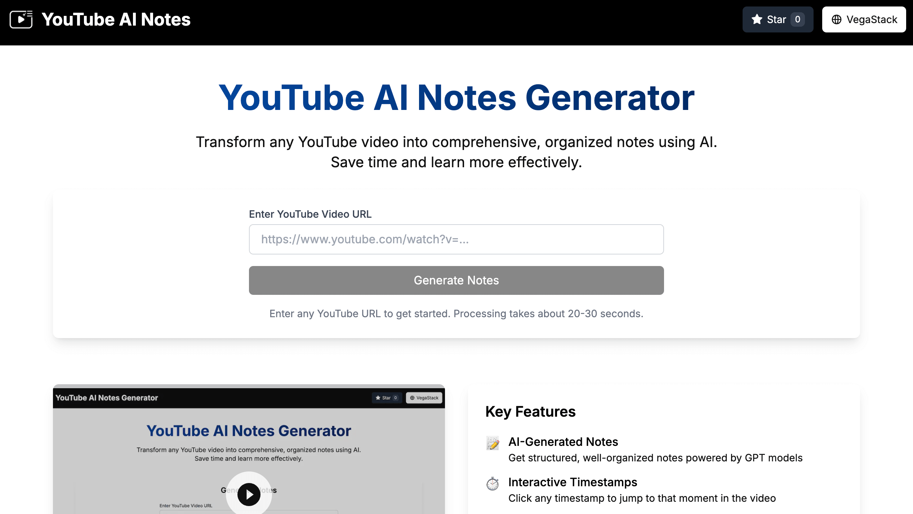

# YouTube AI Notes Generator

YouTube AI Notes Generator automatically extracts transcripts from YouTube videos, processes them with OpenAI, and generates comprehensive, structured notes. This tool makes learning from YouTube videos more efficient by providing shareable, downloadable notes alongside the original video content.

[](https://youtube-notes.vegastack.com)




## Features

### Core Functionality
- **Transcript Extraction**: Automatically extract transcripts from any YouTube video
- **AI-Powered Notes Generation**: Process transcripts with OpenAI GPT models to create structured notes
- **Tabbed Interface**: Toggle between notes view and video+transcript view

### Video & Transcript Features
- **Interactive Transcript**: Click on any timestamp to jump to that point in the video
- **HTML Entity Decoding**: Properly displays apostrophes and special characters in transcripts
- **Copy Transcript**: One-click button to copy the full transcript to clipboard

### Notes Features
- **Copy to Clipboard**: Copy notes in markdown format for use in other applications
- **Download as PDF**: Generate and download a PDF version of the notes
- **Share Link**: Create a shareable link that others can use to access the same notes

### User Experience
- **Video Metadata**: Displays video title, creator name, and upload date (YouTube-style)
- **Responsive Design**: Works on desktop and mobile devices
- **Caching**: Saves generated notes in localStorage for faster repeat visits
- **Loading States**: Clear feedback during processing and generation

### Technical Features
- **Cloudflare Worker**: Serverless function for transcript extraction
- **OpenAI Integration**: Secure API processing for note generation
- **Shareable URLs**: Clean URLs with just the video ID for easy sharing
- **Error Handling**: Graceful error recovery with helpful messages

## Tech Stack

- **Frontend**: Next.js 14, React, TypeScript, Tailwind CSS
- **PDF Generation**: jsPDF, html2canvas
- **Serverless**: Cloudflare Workers
- **AI**: OpenAI GPT models
- **Deployment**: Cloudflare Pages

## Project Structure

```
youtube-notes-generator/
├── .env.local.example        # Example environment variables
├── next.config.js            # Next.js configuration
├── package.json              # Project dependencies
├── public/                   # Static assets
├── src/
│   ├── app/                  # Next.js App Router
│   │   ├── api/              # API routes for server-side functions
│   │   ├── notes/[videoId]/  # Dynamic route for video notes
│   │   ├── page.tsx          # Home page with form
│   │   └── layout.tsx        # Root layout
│   ├── components/           # React components
│   │   ├── NotesViewer.tsx   # Notes display with actions
│   │   ├── TranscriptViewer.tsx # Transcript display with timestamps
│   │   └── YouTubePlayer.tsx # YouTube embedded player
│   ├── lib/                  # Shared libraries
│   │   ├── openai.ts         # OpenAI API integration
│   │   ├── youtube.ts        # YouTube API and utilities
│   │   └── types.ts          # TypeScript interfaces
│   └── utils/                # Utility functions
│       ├── extractVideoId.ts # YouTube URL parsing
│       └── formatTranscript.ts # Transcript formatting helpers
└── workers/
    └── transcript-worker/    # Cloudflare Worker for transcript extraction
        ├── src/index.js      # Worker script
        ├── package.json      # Worker dependencies
        └── wrangler.toml     # Worker configuration
```

## Setup & Deployment

### Prerequisites

- [Node.js](https://nodejs.org/) (v18 or newer)
- [Cloudflare account](https://dash.cloudflare.com/sign-up)
- [Wrangler CLI](https://developers.cloudflare.com/workers/wrangler/install-and-update/) for deploying Cloudflare Workers
- [OpenAI API key](https://platform.openai.com/account/api-keys)
- [YouTube API key](https://developers.google.com/youtube/v3/getting-started) (optional, for enhanced metadata)

### Local Development Setup

1. **Clone the repository**
```bash
git clone https://github.com/yourusername/youtube-notes-generator.git
cd youtube-notes-generator
```

2. **Install dependencies**
```bash
npm install
```

3. **Create a `.env.local` file**
```
NEXT_PUBLIC_WORKER_URL=https://your-transcript-worker.username.workers.dev
OPENAI_API_KEY=your-openai-api-key
OPENAI_MODEL=gpt-4-turbo-preview
SUMMARY_PROMPT="Based on the following YouTube video transcript, create comprehensive structured notes. Format the notes with clear headings, bullet points, and highlight key concepts. Include a brief summary at the beginning. Here's the transcript:"
NEXT_PUBLIC_YOUTUBE_API_KEY=your-youtube-api-key
```

4. **Start the development server**
```bash
npm run dev
```

### Deploying the Cloudflare Worker

1. **Navigate to the worker directory**
```bash
cd workers/transcript-worker
```

2. **Install worker dependencies**
```bash
npm install
```

3. **Configure your worker**
Edit `wrangler.toml` with your account details if necessary:
```toml
name = "youtube-transcript-worker"
main = "src/index.js"
compatibility_date = "2023-10-30"
```

4. **Login to Cloudflare (if you haven't already)**
```bash
npx wrangler login
```

5. **Deploy the worker**
```bash
npx wrangler deploy
```

6. **Note the worker URL**
After deployment, you'll receive a URL like `https://youtube-transcript-worker.yourusername.workers.dev`. Save this URL for the next step.

### Deploying to Cloudflare Pages

1. **Return to the project root directory**
```bash
cd ../..
```

2. **Build the project**
```bash
npm run build
```

3. **Set up Cloudflare Pages via Dashboard**

   a. Go to the [Cloudflare Dashboard](https://dash.cloudflare.com)
   b. Navigate to **Pages** > **Create a project** > **Connect to Git**
   c. Select your repository and configure:
      - Framework preset: **Next.js**
      - Build command: `npm run build`
      - Build output directory: `.next`
      - Node.js version: **18** (or higher)

4. **Add environment variables**

   Add the following environment variables in the Cloudflare Pages dashboard:
   
   | Variable | Description |
   |----------|-------------|
   | `NEXT_PUBLIC_WORKER_URL` | URL of your deployed Cloudflare Worker |
   | `OPENAI_API_KEY` | Your OpenAI API key |
   | `OPENAI_MODEL` | Model to use (e.g., `gpt-4-turbo-preview`) |
   | `SUMMARY_PROMPT` | Prompt template for generating notes |
   | `NEXT_PUBLIC_YOUTUBE_API_KEY` | (Optional) YouTube Data API key |

5. **Deploy**

   Trigger a deployment from the Cloudflare dashboard.

## Usage

1. Visit your deployed application
2. Enter a YouTube URL in the input field
3. Click "Generate Notes"
4. View the generated notes, or switch to the Video & Transcript tab
5. Use the Copy, Download, or Share buttons to save or share your notes

## Customization Options

### Changing the Notes Generation Prompt

You can customize how the AI generates notes by modifying the `SUMMARY_PROMPT` environment variable:

```
SUMMARY_PROMPT="Create structured notes from this transcript with the following sections: Overview, Key Points, Detailed Breakdown, and Conclusion. Use bullet points and highlight important concepts."
```

### Using a Different OpenAI Model

Change the `OPENAI_MODEL` environment variable to use a different model:

```
OPENAI_MODEL=gpt-4o-mini
```

### Styling Changes

The application uses Tailwind CSS for styling. You can modify the theme in `tailwind.config.js`:

```javascript
theme: {
  extend: {
    colors: {
      primary: {
        // Your custom color palette
      },
    },
  },
},
```

## Troubleshooting

### Worker Issues
- **CORS Errors**: Ensure the worker has proper CORS headers set
- **Rate Limiting**: YouTube may rate-limit excessive requests for transcripts
- **Missing Transcript**: Some videos may not have available transcripts

### Frontend Issues
- **API Keys**: Make sure all environment variables are correctly set
- **PDF Generation**: If PDF downloads fail, check browser console for errors
- **LocalStorage**: Clear localStorage if you encounter caching issues

## Contributing

Contributions are welcome! Please feel free to submit a Pull Request.

## License

This project is licensed under the MIT License - see the LICENSE file for details.

## Acknowledgments

- [YoutubeTranscript](https://www.npmjs.com/package/youtube-transcript) for transcript extraction
- [OpenAI](https://openai.com/) for GPT models
- [Next.js](https://nextjs.org/) for the frontend framework
- [Cloudflare Workers](https://workers.cloudflare.com/) for serverless functionality